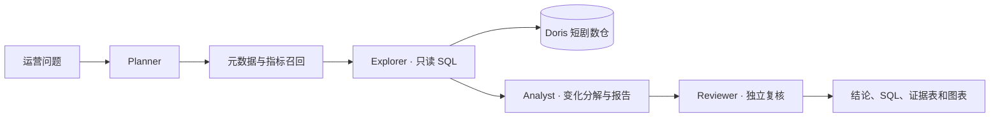

# InsightQuery｜AI 产品运营智数归因平台

InsightQuery 面向海外 AI 短剧的内容消费与付费转化分析：运营人员用自然语言提出问题，系统定位指标和数据表、生成只读 SQL、计算变化贡献，并给出可复核的证据与报告。项目沿用 Agent 问数底座，将业务模型、指标口径和工作台文案改造为短剧场景。

## 核心能力

- **自然语言问数**：从短剧元数据中检索表、字段和指标，生成并执行 Doris 只读 SQL。
- **运营指标分析**：覆盖开播用户、次集续看、单集完播、付费墙展示、成功解锁、付费转化和收入。
- **变化归因**：按市场、题材、剧集与内容来源拆解两个统计窗口，核对分项贡献与总变化。
- **多 Agent 复核**：Planner 编排任务，Explorer 取数，Analyst 形成证据表与 HTML 报告，Reviewer 独立复算。
- **查询安全与可追溯**：Doris 查询角色授权、SQL 只读校验、隔离的 Docker 分析沙箱、查询结果和报告附件留痕。



## 数据模型与口径

专用 Doris 库为 `insightquery_short_drama`，包含 7 张表、35 个字段和 7 个预置指标。合成数据固定覆盖 2026-09-01 至 2026-09-14，分为两个连续的七日窗口。

| 表 | 粒度与用途 |
| --- | --- |
| `dim_market` | 市场、国家与语言 |
| `dim_series` | 剧集、题材与内容来源 |
| `dim_episode` | 单集顺序与付费集标记 |
| `dim_user` | 匿名用户与注册市场 |
| `fact_episode_view` | 开播、完播和观看时长事件 |
| `fact_paywall_event` | 付费墙展示与解锁尝试 |
| `fact_purchase` | 解锁交易及美元金额 |

关键口径：

- **开播用户数**：周期内 `started=1` 的去重 `user_id`。
- **次集续看率**：同一剧、同一周期内，看过第 1 集且继续看第 2 集的去重用户数 ÷ 第 1 集开播去重用户数。
- **单集完播率**：`sum(completed) / nullif(sum(started), 0)`。
- **付费解锁转化率**：付费墙展示用户中成功解锁的去重用户数 ÷ 付费墙展示去重用户数。
- **成功解锁收入**：`status='success'` 的交易金额之和，单位美元。

比率按汇总后的分子、分母计算，不直接平均各剧比率；多张事件表先分别聚合，再按一致粒度关联，避免明细 JOIN 放大计数。完整配置见 [元数据定义](conf/meta_config.yaml) 和 [数据生成说明](dbmock/README.md)。

## 技术栈

| 层 | 技术 |
| --- | --- |
| 前端 | React、TypeScript、Vite |
| API 与 Agent | FastAPI、LangGraph、DeepAgents、SSE |
| 数据与检索 | Apache Doris、PostgreSQL、Elasticsearch、Redis |
| 异步与隔离 | Celery、Docker 分析沙箱 |
| 模型 | 可配置 LLM；默认使用 DeepSeek，Embedding 使用 SiliconFlow BGE-M3 |

## 本地运行

需要 Python 3.12+、[uv](https://docs.astral.sh/uv/)、Node.js/npm 与 Docker Desktop。Elasticsearch 配置了 4 GiB 内存上限，请为 Docker 分配足够资源。以下命令在项目根目录执行。

### 1. 配置环境

```powershell
Copy-Item conf/.env.example conf/.env
Copy-Item dbmock/.env.example dbmock/.env
Copy-Item web/.env.example web/.env
```

填写 `conf/.env` 中的数据库密码、管理员凭据、`DEEPSEEK_API_KEY` 和 `SILICONFLOW_API_KEY`；填写 `dbmock/.env` 中的数据写入凭据。Compose 的本地初始数据库口令为 `123123`，对应的 `DORIS_ADMIN_PASSWORD`、`POSTGRES_PASSWORD` 和 `DB_PASSWORD` 必须一致。对外部署前应更换口令并调整 Compose 配置。密钥只保存在本地 `.env`，不要提交到仓库。

### 2. 启动依赖并准备数据

```powershell
docker compose -f docker/compose.yml build sandbox-image elasticsearch
docker compose -f docker/compose.yml up -d
uv sync
uv run scripts/init_db.py
uv run -m scripts.bootstrap_admin
cd dbmock
uv run --env-file .env main.py --load
cd ..
```

`--load` 只允许写入空的专用短剧库；已有业务表时会拒绝覆盖。再次启动已有环境时，跳过初始化和导入步骤，直接运行 `docker compose -f docker/compose.yml up -d`。

### 3. 启动应用

在三个终端分别运行：

```powershell
uv run main.py
uv run celery --app app.shared.tasks.celery_app:celery_app worker --pool=solo -l INFO
cd web; npm ci; npm run dev
```

Windows 下 Celery 使用 `--pool=solo`；Linux/macOS 可使用默认 worker pool。前端地址为 <http://localhost:7011>，API 文档为 <http://localhost:7010/docs>。Docker 服务仅绑定本机回环地址：PostgreSQL 5433、Elasticsearch 9201、Redis 6380、Doris 9031。

### 4. 首次管理配置

1. 使用 `conf/.env` 中的管理员账号登录，进入 **管理中心 → Doris 角色管理**，创建查询角色与查询身份。
2. 为该角色授予 `insightquery_short_drama` 的 SELECT 权限，分配给管理员，并设为新用户默认角色；角色变更后重新登录。
3. 在 **元数据管理** 导入 `conf/meta_config.yaml`，选择“全量替换”，等待字段与指标语义索引任务完成。

管理员操作和元数据导入只需在首次初始化时完成。角色配置、会话和元数据保存在 Docker 数据卷中。

## 可复现的分析

可在工作台输入：

1. 对比 9 月 1–7 日与 8–14 日，美国市场 *Midnight Contract* 的第 1、2 集开播去重用户数和次集续看率。
2. 按市场与短剧拆解两周成功解锁收入变化，核对分项变化之和与总变化。
3. 分析美国市场 AI 辅助制作短剧的付费墙展示到成功解锁转化率。

第一条问题已完成真实服务联调：第 1 集开播用户为 **168 → 168**，第 2 集为 **126 → 63**，次集续看率为 **75.0% → 37.5%**，下降 **37.5 个百分点**。Explorer 执行只读 SQL，Analyst 生成报告，Reviewer 对修订版完成 **48/48 项复核**。可查看自包含的 [分析报告](docs/midnight-contract-analysis.html)。这些数值仅来自仓库中的合成数据。

离线验证命令：

```powershell
python dbmock/main.py
python dbmock/verify_golden.py
python -m compileall -q app dbmock main.py
cd web; npm run build
```

## 项目边界

InsightQuery 聚焦**产品内内容消费和付费解锁**的问数与指标变化分析。广告 Campaign/Creative、CPI、ROAS 和用户反馈联合诊断由 GrowthTriage 项目承担；本项目不执行广告投放或自动调价。报告中的分解结果只能说明数据贡献，运营原因仍需结合实验、渠道和内容生产信息验证。
